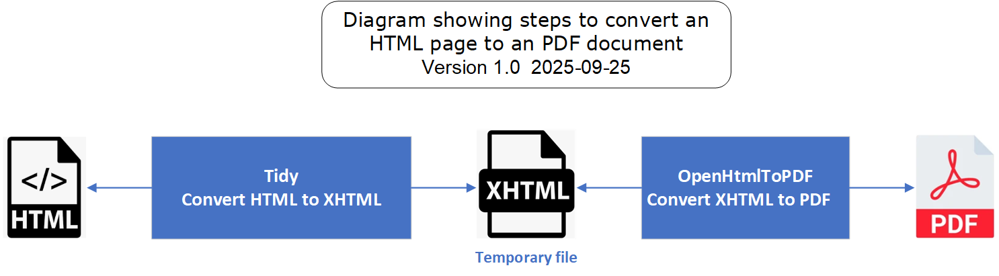

# convert-html-to-pdf
Convert a simple HTML page to PDF document

 
Project at GitHub : https://github.com/vdaburon/convert-html-to-pdf

##  Example
Convert a HTML page to a PDF document, set the image width.

Parameters :
- html_in the html page to read
- pdf_out the pdf document to generate
- (optional) image_width the image width in the html page

Launch of the conversion: 
<code>java -jar convert-html-to-pdf-1.0-jar-with-dependencies.jar -html_in index.html -pdf_out report.pdf -image_width 960</code>

Notes: 
- The directory where the HTML file is set must be writable to create a temporary XHTML file inside
- Need a JDK/JRE 1.8 or more

## License
See the GNU Lesser General Public License (LGPL), version 3 
[https://www.gnu.org/licenses/lgpl-3.0.html](https://www.gnu.org/licenses/lgpl-3.0.html)

Because library com.openhtmltopdf use this license

## Ready to use
In the [Release of the project](https://github.com/vdaburon/convert-html-to-pdf/releases)  you will find the tool compiled in one (uber) jar file which is directly usable.

## Help
<pre>
usage: io.github.vdaburon.converthtml2pdf.Html2PDFConvertor [-help] -html_in &lt;html_in&gt; [-image_width &lt;image_width&gt;]
       -pdf_out &lt;pdf_out&gt;
io.github.vdaburon.converthtml2pdf.Html2PDFConvertor
 -help                        Help and show parameters
 -html_in &lt;html_in&gt;           Html file to read (e.g: index.html)
 -image_width &lt;image_width&gt;   Optional, Image width in pixels referenced by the html page (e.g:960)
 -pdf_out &lt;pdf_out&gt;           PDF file generated (e.g: report.pdf)
E.g : java -jar convert-html-to-pdf-&lt;version&gt;-jar-with-dependencies.jar -html_in index.html -pdf_out report.pdf
-image_width 960

</pre>

## Link to others projects
Usually this plugin is use with [jmeter-graph-tool-maven-plugin](https://github.com/vdaburon/jmeter-graph-tool-maven-plugin) 
and this plugin [create-html-for-files-in-directory](https://github.com/vdaburon/CreateHtmlForFilesInDirectory)
1) The **jmeter-graph-tool-maven-plugin** create the report csv files and graphs
2) The **csv-report-to-html** create the **html table report** from the csv file
3) The **create-html-for-files-in-directory** create a page html this links to images and files in a directory to show and add links

## Versions
2025-09-25, Version 1.0

